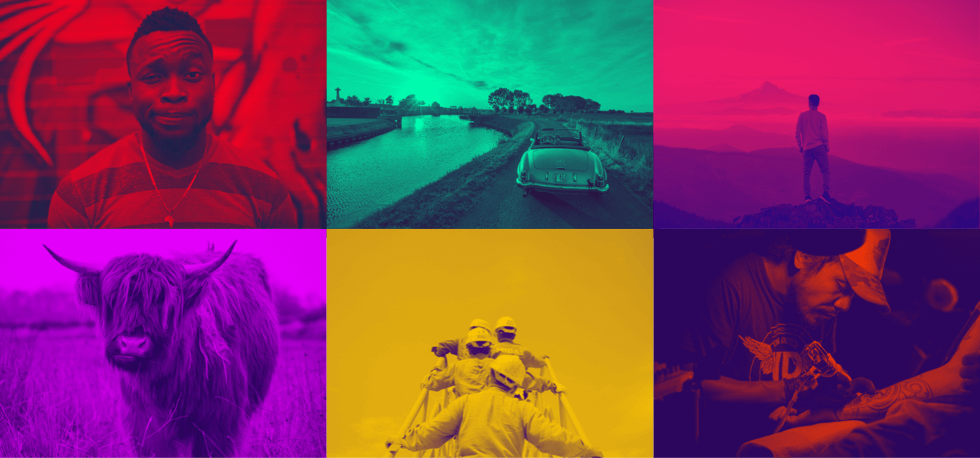

# DUOTONE

Apply [duotone](https://en.wikipedia.org/wiki/Duotone) effects to images using GPU acceleration. Thanks to the use of Metal it's on average 75 times faster than the original [Python version](https://github.com/carloe/duotone-py).



## Install

```bash
git clone git@github.com:carloe/duotone-swift.git
cd duotone
swift package update
swift build -c release
cp -f .build/release/duotone /usr/local/bin/duotone
duotone --help
```

## Usage

```bash
# Single Image...
duotone input.jpg --light '#FFCB00' --dark '#38046C' --out output.png

# Batch processing...
duotone ~/images --light '#FFCB00' --dark '#38046C' --out ~/images/out
```

## License

MIT
