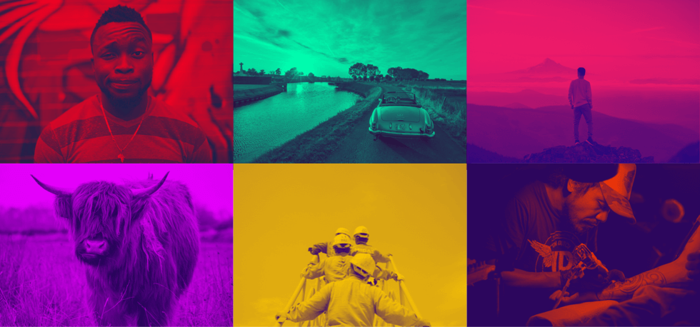

# DUOTONE

Apply [duotone](https://en.wikipedia.org/wiki/Duotone) effects to images using GPU acceleration. Thanks to the use of Metal it's on average 75 times faster than the original [Python version](https://github.com/carloe/duotone-py).



## Install

```bash
git clone git@github.com:carloe/duotone-swift.git
cd duotone-swift
swift package update
swift build -c release
cp -f .build/release/duotone /usr/local/bin/duotone
duotone --help
```

## Usage

Duotone individual files or batch process entire folders. `--out` is a folder path (which must already exist); each output file is written inside it with the same filename as its input.

```bash
# Single image (writes ./out/input.jpg)
mkdir -p ./out
duotone input.jpg --light '#FFCB00' --dark '#38046C' --out ./out

# Batch processing (writes ~/images/out/*.jpg)
mkdir -p ~/images/out
duotone ~/images --light '#FFCB00' --dark '#38046C' --out ~/images/out
```

## Presets

Settings can be saved as preset so they can be reused without having to juggle or memorize hex colors.

```bash
# List all presets
duotone list

# Add a new preset named 'foo'
duotone add --preset foo --light '#FFCB00' --dark '#38046C' --contrast 0.5 --blend 0.5

# Remove the preset named foo
duotone remove --preset foo

# Apply the preset 'foo' to 'file.jpg' (writes ./out/file.jpg)
mkdir -p ./out
duotone file.jpg --preset foo --out ./out
```

Presets are saved as JSON, and can also be edited directly.

```bash
vim ~/.duotone
```

```json
[
  {
    "blend" : 1,
    "light" : "#444644",
    "dark" : "#1e201e",
    "contrast" : 0.5,
    "name" : "spacegray"
  }
]
```

## License

MIT
